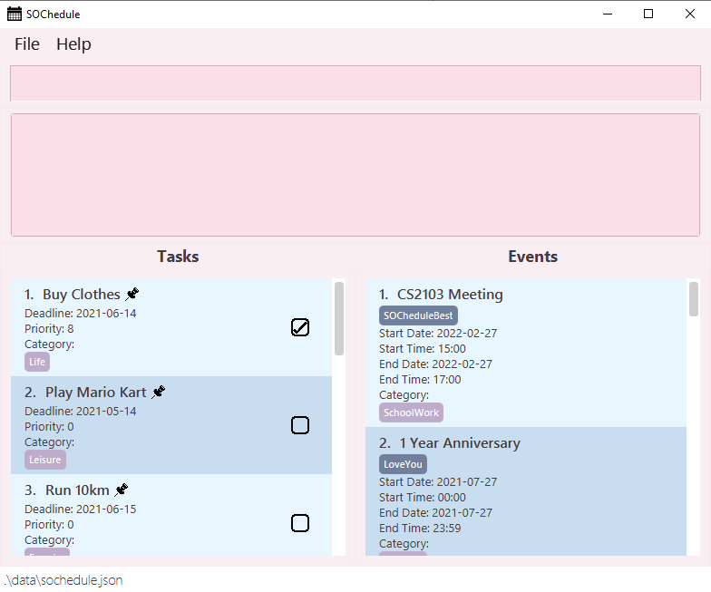

## User Guide

SOChedule is a one-stop solution for managing tasks and events, optimized for use via a Command Line Interface (CLI) while still having the benefits of a Graphical User Interface (GUI).

## Feature List
* Adding a task: `add_task`
* Deleting a task: `delete_task`
* Listing all tasks: `list_task`
* Marking a task as done : `done_task`
* Adding an event: `add_event`
* Deleting an event: `delete_event`
* Listing all events: `list_event`

--------------------------------------------------------------------------------------------------------------------

## Quick start

1. Ensure you have Java `11` or above installed in your Computer.

1. Download the latest `SOChedule.jar` from [link coming soon].

1. Copy the file to the folder you want to use as the _home folder_ for your SOChedule.

1. Double-click the file to start the app. The GUI similar to the below should appear in a few seconds. Note how the app contains some sample data. 
   

1. Type the command in the command box and press Enter to execute it. e.g. typing **`help`** and pressing Enter will open the help window. 
   Some example commands you can try:

   * **`list_task`** : Lists all tasks.

   * **`add_task`**`n/CS2103 assignment d/2021-02-27 p/1 c/school work t/urgent` : Adds a task named `CS2103 assignment` to the SOChedule with its respective attributes.

   * **`delete_task`**`3` : Deletes the 3rd task shown in the current list.

   * **`exit`** : Exits the app.

1. Refer to the [Features](#features) below for details of each command.

--------------------------------------------------------------------------------------------------------------------

## Features

### Adding a task: `add_task`
Adds a task to SOChedule Task List.

Format: `add_task n/TASKNAME d/DEADLINE p/PRIORITY [c/CATEGORY]... [t/TAG]...`
* `n/` is followed by the task name.
* `d/` is followed by the date, with the format YYYY-MM-DD.
* `p/` is followed by the priority, with 0 being highest and 9 being lowest. Other inputs are not accepted.
* `c/` is followed by the category. It is optional.
* `t/` is followed by the tag. It is optional.

Examples:
* `add_task n/CS2103 assignment d/2021-02-27 p/1 c/school work t/urgent` adds a new task named "CS2103 assignment" with the respective parameters.
* `add_task n/CCA admin work d/2021-02-28 p/2 c/CCA` adds a new task "CCA admin work" with the respective parameters.

### Listing all tasks: `list_task`
Lists all tasks from SOChedule Task List.

Format: `list_task`

### Deleting a task: `delete_task`
Deletes a task from SOChedule Task List.

Format: `delete_task INDEX`
* Deletes the task at the specified INDEX.
* The index refers to the index number shown in the displayed task list.
* The index must be a positive and valid integer 1, 2, 3, ...

Examples:
* `delete_task 2` deletes the second task in the task list.

### Marking a task as done: `done_task`
Marks a task from SOChedule Task List as completed.

Format: `done_task INDEX`
* Marks the task at the specified INDEX as complete.
* The index refers to the index number shown in the displayed task list.
* The index must be a positive and valid integer 1, 2, 3, ...

Examples:
* `done_task 1` marks the first task in the task list as completed.

### Adding an event: `add_event`
Adds an event to the SOChedule Event Scheduler.
Format: `add _event n/TASKNAME sd/STARTDATE st/STARTTIME ed/ENDDATE et/ENDTIME [c/CATEGORY]... [t/TAG]...`
* `n/` is followed by the task name, it is case-sensitive.
* `sd/` is followed by the starting date, it has to be a **valid date** and in the format of **YYYY-MM-DD**. Here, Y is the year, M is the month, D is the day and all has to be integers.
* `st/` is followed by the time in 24-hour format and in the format of **hh:mm** Here, h is the hour, m is the minute and all has to be integers.
* `ed/` is followed by the end date, it has to be a **valid date** and in the format of **YYYY-MM-DD**.
* `et/` is followed by the time in 24-hour format and in the format of **hh:mm**.
* `c/` is followed by the category. It is optional.
* `t/` is followed by the tag. It is optional.
  
Examples:
* `add_event n/CS2103 meeting sd/2021-02-27 st/15:00 ed/2021-02-27 et/17:00` adds an event with name `CS2103` and its respective attributes to the SOChedule Event Scheduler.
  
### Deleting an event: `delete_event`
Deletes an event from the SOChedule Event Scheduler.

Format: `delete_event INDEX`
* Deletes the event at the specified INDEX.
* The index refers to the index number shown in the displayed event list.
* The index must be a positive and valid integer 1, 2, 3, ...

Examples:
* `delete_event 3` deletes the third event from the Event Scheduler.

### Listing all events: `list_event`
Lists all events from SOChedule Event Scheduler.
Format: `list_event`

### Archiving data files `[coming in v2.0]`

_Details coming soon ..._

--------------------------------------------------------------------------------------------------------------------

## FAQ

**Q**: How do I transfer my data to another Computer? 
**A**: Install the app in the other computer and overwrite the empty data file it creates with the file that contains the data of your previous SOChedule home folder.

--------------------------------------------------------------------------------------------------------------------

## Command summary

###General commands
Action | Format, Examples
--------|------------------
**Help** | `help`
**Exit** | `exit`

###Task-related commands
Action | Format, Examples
--------|------------------
**Add** | `add_task n/TASKNAME d/DEADLINE p/PRIORITY [c/CATEGORY]... [t/TAG]...`   e.g., `add_task n/CS2103 assignment d/2021-02-27 p/1 c/school work t/urgent`
**Delete** | `delete_task INDEX` e.g., `delete_task 1`
**Done** | `done_task INDEX` e.g., `done_task 1`
**List** | `list_task`

###Event-related commands
Action | Format, Examples
--------|------------------
**Add** | `add_event n/TASKNAME sd/STARTDATE st/STARTTIME ed/ENDDATE et/ENDTIME [c/CATEGORY]... [t/TAG]...`  e.g., `add_event n/CS2103 meeting sd/2021-02-27 st/15:00 ed/2021-02-27 et/17:00`
**Delete** | `delete_event INDEX` e.g., `delete_event 3`
**List** | `list_event`
